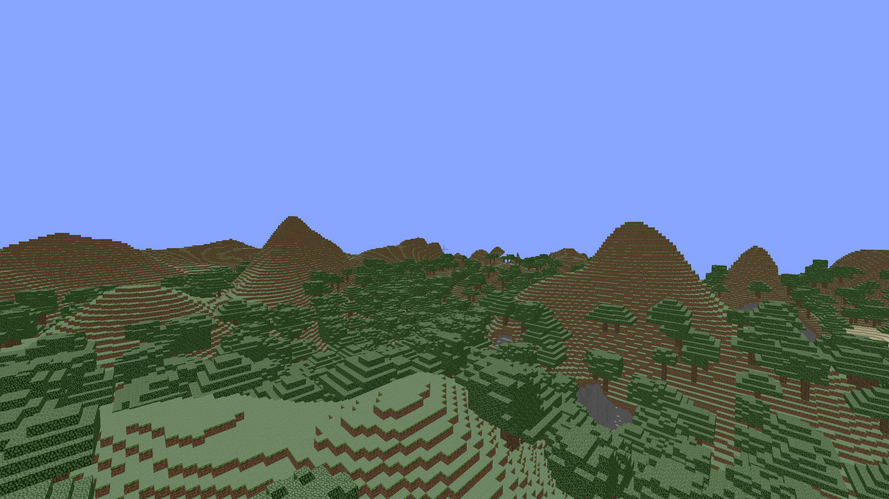

# ft_vox



Intro
-----
Voxel game engine written in C++ using OpenGL.   
The engine is primarily focused on the challenges behind generating and rendering a procedural world in real time.  

Usage
-----
`./ft_vox [world_seed]`

### Keymap:  
**WASD**  - move around  
**F**     - toggle fullscreen  
**I**     - toggle debug info HUD  
**M**     - toggle [wireframe](https://raw.githubusercontent.com/indiedriver/ft_vox/master/screenshots/wireframe.png) mode  

Build
-----
```
git clone --recursive https://github.com/indiedriver/ft_vox
cd ft_vox
cmake .
```
